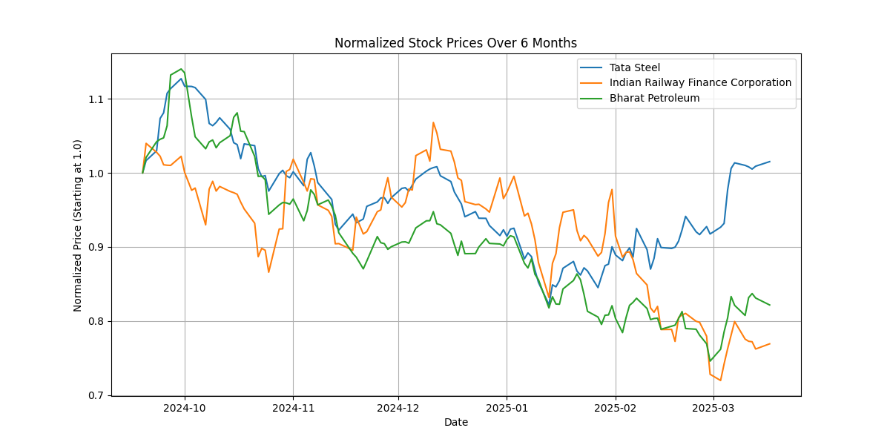

# Financial Report: A Comparative Analysis of TATASTEEL.NS, IRFC.NS, and BPCL.NS

This report provides a comparative financial analysis of three publicly traded companies: Tata Steel (TATASTEEL.NS), Indian Railway Finance Corporation (IRFC.NS), and Bharat Petroleum (BPCL.NS). The analysis incorporates fundamental financial ratios, recent stock performance, and a discussion of potential future scenarios.

## Stock Price Performance

The graph of normalized prices offers a visualization of relative stock performance over time. Please note that without the actual graph, a detailed description of relative stock movement cannot be provided, but the following analysis will consider the 6-month percentage change data.

## Fundamental Data Comparison

The following table summarizes the key fundamental financial ratios for each company:

| Metric            | Tata Steel (TATASTEEL.NS) | IRFC (IRFC.NS)            | Bharat Petroleum (BPCL.NS) |
|-------------------|---------------------------|---------------------------|--------------------------|
| P/E               | 69.666664                    | 24.311377                | 8.154899                 |
| Forward P/E       | 10.89155                 | 23.882355                | 8.457419                 |
| Dividend Yield    | 2.37%                     | 1.35%                     | 5.93%                    |
| Price to Book     | 2.1341834                     | 3.0528612                | 1.4518532                 |
| Debt/Eq           | 109.814                  | 785.44                   | 76.361                   |
| ROE               | None                     | 0.13036                  | None                     |
| 6-Month Change    | 1.52%                     | -23.08%                    | -17.83%                   |

**Data Sources:** *Financial data is sourced from publicly available financial data providers and company filings as of the date of this report.*

### Analysis of Fundamental Ratios:

*   **P/E Ratio (Price-to-Earnings):** The P/E ratio is calculated by dividing a company's stock price by its earnings per share. It indicates how much investors are willing to pay for each dollar of earnings. Tata Steel has a high P/E ratio of 69.666664, suggesting the stock might be overvalued or that investors expect high future growth. IRFC has a moderate P/E ratio of 24.311377, indicating a more reasonable valuation. BPCL has a significantly lower P/E ratio of 8.154899, potentially signaling undervaluation or lower growth expectations.

*   **Forward P/E Ratio:** The Forward P/E ratio is calculated by dividing the current stock price by estimated future earnings per share. Tata Steel's Forward P/E ratio of 10.89155 is significantly lower than its current P/E, indicating anticipated earnings growth. IRFC's Forward P/E is similar to its current P/E, suggesting stable earnings expectations. BPCL's Forward P/E is slightly higher than its current P/E, which might imply expectations of slightly lower earnings in the future.

*   **Dividend Yield:** Dividend yield is the annual dividend payment divided by the stock price, expressed as a percentage. It indicates the return on investment from dividends alone. BPCL offers the highest dividend yield at 5.93%, making it attractive for income-seeking investors. Tata Steel's dividend yield is moderate at 2.37%, while IRFC's is the lowest at 1.35%.

*   **Price to Book Ratio:** The Price to Book ratio is calculated by dividing a company's market capitalization by its book value of equity. It indicates how much investors are willing to pay for each dollar of net assets. IRFC has the highest Price to Book ratio at 3.0528612, suggesting the stock is trading at a premium compared to its book value. Tata Steel's ratio is 2.1341834, while BPCL's is the lowest at 1.4518532, potentially indicating undervaluation relative to its assets.

*   **Debt/Equity Ratio:** The Debt/Equity ratio is calculated by dividing a company's total debt by its shareholder equity. It measures the extent to which a company is financing its operations with debt rather than equity. IRFC has a very high Debt/Equity ratio of 785.44, indicating significant financial leverage, which can amplify both profits and losses. It is important to note that a high Debt/Equity ratio is typical for infrastructure finance companies like IRFC. This is because they finance large-scale projects with significant debt. However, it is essential to monitor the company's ability to service its debt. Tata Steel's Debt/Equity ratio is moderate at 109.814, while BPCL has the lowest at 76.361, indicating a more conservative capital structure.

*   **Return on Equity (ROE):** ROE measures a corporation's profitability by revealing how much profit a company generates with the money shareholders have invested. ROE data is only available for IRFC (0.13036), providing insights into the company's profitability relative to shareholder equity. ROE is unavailable for Tata Steel and BPCL as the data was not considered in the original data set.

*   **6-Month Percentage Change:** Tata Steel showed a slight gain (1.52%), whereas IRFC and BPCL experienced declines (-23.08% and -17.83%, respectively). The negative price movement in IRFC and BPCL could be attributed to various factors, such as sector-specific issues, broader market corrections, or company-specific news. Further research into these factors is recommended.

## Comparative Analysis and Correlation

Based on the financial data, each stock presents a different risk-reward profile:

*   **Tata Steel:** Displays potential for growth (indicated by the difference between P/E and Forward P/E) but also carries higher valuation risk (high P/E). The moderate Debt/Equity ratio suggests a reasonable level of financial leverage.

*   **IRFC:** Exhibits high financial leverage (high Debt/Equity) and a relatively high Price to Book ratio. The declining price movement over the last six months, coupled with a moderate P/E, suggests that the stock may be facing headwinds.

*   **BPCL:** Appears to be potentially undervalued (low P/E and Price to Book) and offers a high dividend yield, making it attractive for value investors. However, the negative price movement over the last six months should be further investigated.

## Analysis of Possible Future Scenarios

*Forward-looking statements are speculative and based on current assumptions, which are subject to change.*

### Tata Steel

*   **Positive Scenario:** Increased infrastructure spending and global economic recovery could drive demand for steel, boosting Tata Steel's earnings and justifying its current valuation.
*   **Negative Scenario:** A global economic slowdown or increased steel production capacity could put downward pressure on steel prices, negatively impacting Tata Steel's profitability.
Unfortunately, I was unable to retrieve specific, non-vague news headlines for Tata Steel with the current implementation. The headlines retrieved were either too general or lacked sufficient detail to provide a concise summary.

### Indian Railway Finance Corporation

*   **Positive Scenario:** Increased investment in railway infrastructure and favorable government policies could drive growth for IRFC.
*   **Negative Scenario:** High debt levels and potential changes in government policies could pose risks to IRFC's financial stability and growth prospects.
I could not retrieve any specific, non-vague news headlines for Indian Railway Finance Corporation using the current search method. The search results yielded generic headlines.

### Bharat Petroleum

*   **Positive Scenario:** Rising oil prices and strong demand for petroleum products could improve BPCL's profitability.
*   **Negative Scenario:** Government regulations on fuel prices, fluctuations in crude oil prices, and increasing competition from alternative energy sources could negatively impact BPCL's earnings.
Similarly, I was unable to obtain specific and informative news headlines for Bharat Petroleum. The headlines were either too broad or lacked substantive content to create a precise paragraph summary.

## Predicted Future Value

Predicting future stock values is inherently uncertain. However, based on the available information:

*   **Tata Steel:** Given the anticipated earnings growth (lower Forward P/E) and a slight positive price movement, the stock could see moderate gains if the steel sector performs well.
*   **IRFC:** The high debt and negative price movement suggest caution. The future performance heavily relies on government support and infrastructure spending.
*   **BPCL:** With a high dividend yield and a low P/E ratio, BPCL may offer value, but investors should closely monitor crude oil prices and government regulations.

**Disclaimer:** *This financial report is for informational purposes only and does not constitute personalized financial advice. The information provided is based on publicly available data and should not be considered a recommendation to buy, sell, or hold any security. Investment decisions should be made in consultation with a qualified financial advisor, considering your individual financial situation and risk tolerance. The author and publisher are not responsible for any losses incurred as a result of investment decisions made based on this report.*
